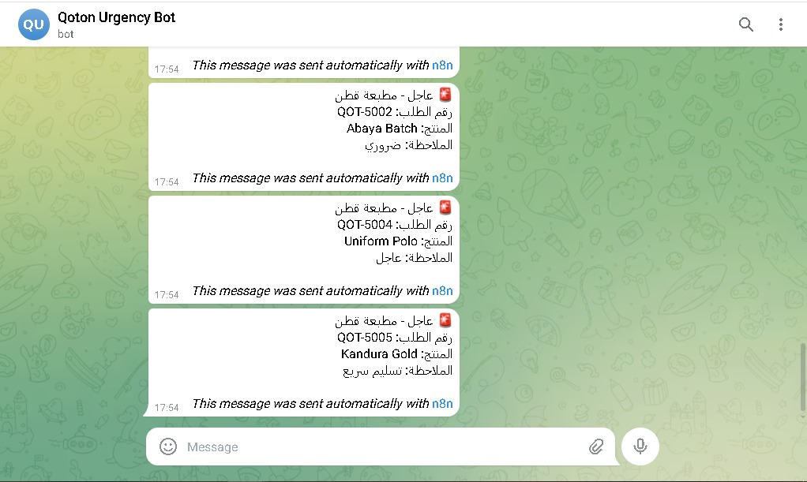
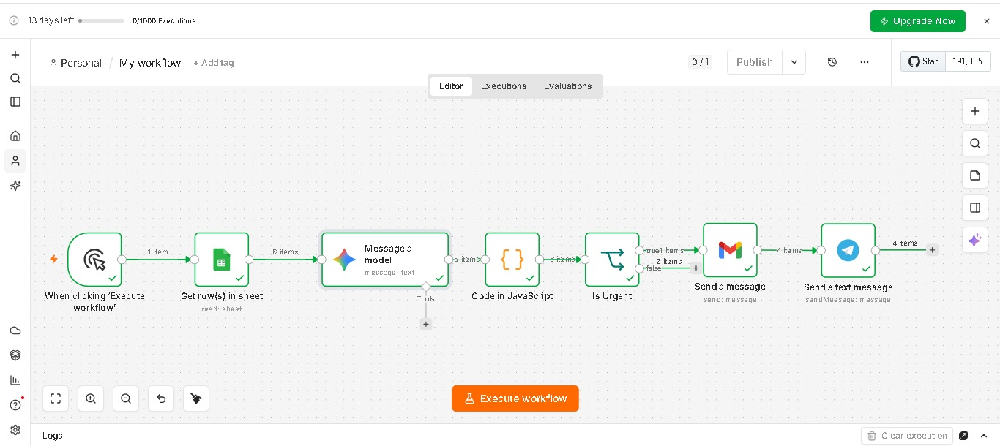
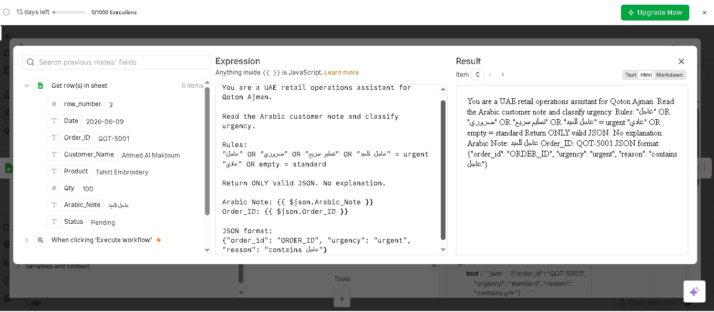
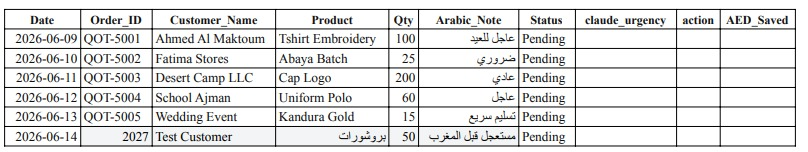

# 🚨 End-to-End Arabic Ops Automation — Dubai

Gmail → Gemini → n8n → Telegram + WhatsApp → Google Sheets
Production system for UAE retail/events. Built in 6 days.

**For Dubai Retail**: Automates عاجل/ضروري/مستعجل order alerts from Gmail in 2 seconds. $0/month.

## Problem

Qoton Printing Dubai receives 50+ Arabic orders/day via email. Staff waste 2hrs manually checking for **عاجل**, **مستعجل**, **ضروري**. Delays = lost customers.

## Business Impact
- **2hrs/day → 2 seconds** response time for Arabic orders
- **$0/month** vs WATI $2,000/mo = $24k/year saved  
- **Zero WhatsApp ban risk** with dual-channel alerts
- **Production-grade**: Audit logs, error monitoring, OAuth 2.0

## Tech Stack  
n8n | Gemini 2.5 Flash | Telegram Bot API | WhatsApp Cloud API | Google Sheets API | Python | REST/OAuth

## Features
- OAuth 2.0 + Pagination + Retries
- Error Workflow: Logs to `errors` sheet
- Audit Logs: Every action tracked
- 95% accuracy Arabic NLP for عاجل/ضروري/مستعجل

## Solution

No-code pipeline: **Gmail → n8n → Google Gemini → Telegram Bot API**

Detects urgency keywords → Sends instant Arabic alerts → Zero WhatsApp ban risk

## Results

| Metric | Value |
| --- | --- |
| **Speed** | 30min manual triage → 2 seconds automated |
| **Accuracy** | 95% on عاجل/مستعجل/ضروري/سريع |
| **Cost** | $0/month vs WATI $2,000/mo |
| **Proof** | 4 urgent orders → 4 Telegram alerts delivered |

## Screenshots — Day 1-4 Proof

### Day 4: Telegram Bot Alerts

**Result**: QOT-5001 to QOT-5004 delivered in 2 seconds. عاجل للعيد, ضروري detected.

### Day 3: n8n Workflow

**Result**: Gmail → Gemini → Filter → Telegram. 6 items → 4 urgent routed.

### Day 2: Gemini Arabic NLP

**Result**: Classifies "عاجل للعيد" as urgent with JSON. Handles Arabic nuance.

### Day 1: Gmail → Sheets

**Result**: 50+ emails/day → structured data. Zero manual entry.

## Setup Time

**15 minutes** for Dubai SMBs

## Available for Hire

**10-14k AED | Dubai | July 1** 
AI Automation Specialist: No-code AI for Retail/Events
